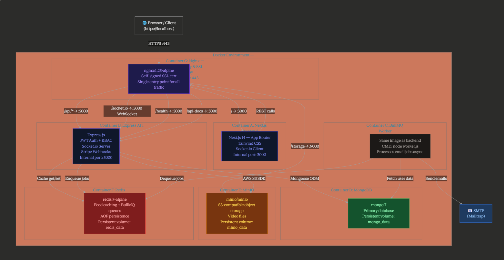

## ClipSphere Architecture Diagram

## Overview

ClipSphere is a full-stack, containerized short-video social platform built using a microservices-oriented architecture. The system is composed of multiple services orchestrated via Docker and routed through Nginx as a reverse proxy.

---

## High-Level Architecture

---

## Component Breakdown

### 1. Frontend (Next.js)
- Handles UI rendering and client-side logic
- Uses Axios for API communication
- Communicates with backend via `/api/*`
- Uses Socket.io client for real-time notifications

---

### 2. Nginx (Reverse Proxy)
- Terminates HTTPS using self-signed SSL certificates
- Routes requests:
  - `/` → Frontend
  - `/api/*` → Backend
  - `/socket.io` → WebSocket server
  - `/storage/*` → MinIO
- Provides a single entry point for all services

---

### 3. Backend (Express.js)
Main API server responsible for:
- Authentication (JWT)
- Video management
- Likes, reviews, and interactions
- Stripe payments (tips)
- Notification system

Key features:
- RESTful API
- Middleware for validation, security, and rate limiting
- Swagger API documentation

---

### 4. Database (MongoDB)
- Stores:
  - Users
  - Videos
  - Transactions
  - Reviews
- Uses Mongoose models

---

### 5. Redis
Used for:
- Caching (video feeds, trending)
- BullMQ job queue
- Improving performance via cache hits

---

### 6. MinIO (Object Storage)
- Stores uploaded video files
- S3-compatible API
- Accessed via backend service

---

### 7. Worker (BullMQ)
- Handles background jobs:
  - Email sending
  - Async processing tasks
- Prevents blocking the main API thread

---

### 8. Socket.io (Real-time Layer)
- Enables live notifications:
  - Likes
  - Reviews
  - Activity updates
- Integrated with backend

---

## Request Flow Example

### Video Feed Request
1. Client requests `/api/v1/videos`
2. Nginx routes to backend
3. Backend checks Redis cache
   - If HIT → return cached data
   - If MISS → fetch from MongoDB
4. Response returned to client
5. Cache updated

---

### Like Action Flow
1. User likes a video
2. Backend:
   - Updates MongoDB
   - Updates trending score
   - Emits Socket.io notification
3. Notification appears in real-time

---

### Upload Flow
1. User uploads video
2. Backend processes file (ffmpeg)
3. File stored in MinIO
4. Metadata stored in MongoDB

---

## Deployment

- Fully containerized using Docker
- Services managed via `docker-compose`
- Supports:
  - Local development (partial services)
  - Full production-like environment (7 containers)

---

## Key Architectural Decisions

- **Microservices-style separation** for scalability
- **Redis caching** to reduce database load
- **Queue-based processing (BullMQ)** for async tasks
- **Reverse proxy (Nginx)** for unified routing
- **Object storage (MinIO)** for media handling

---

## Conclusion

The ClipSphere architecture is designed to be scalable, modular, and production-ready, with clear separation of concerns between services and efficient handling of real-time and asynchronous operations.